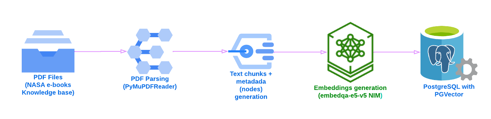

# PDF Documents Ingestion Pipeline into PGVector
The notebook in this directory provides a reference implementation of a __document ingestion pipeline__ that creates a
__knowledge base (KB) from documents belonging to a specific domain__. The documents get encoded by the NIM test embedder 
as high dimensional vectors and these vectors get stored in a __vector DB__ powered by __PGVector (a PostgreSQL add-on)__. 
This vector store provides the __retrieval engine__  to __augment and ground the generation process of LLMs__ 
when __answering questions__ about the __knowledge base__.

The following diagram illustrates how the document ingestion pipeline works.



## Notebook Details and Instructions
- Our knowledge base consists of [__10 NASA history books__](https://www.nasa.gov/ebooks/). The RAG pipelines we build in this series of
  notebooks have the goal of grounding an LLM to make it answer questions about the content of these books without
  making things up (hallucinating) or using its pre-training data as a knowledge base to generate answers.
- The ingestion pipeline is powered by __LlamaIndex (tested on v0.11.x)__
- We use Nvidia NIMs to run the embedding and LLM services:
  - The ingestion pipeline encodes the knowledge base (KB) documents using the __nvidia/nv-embedqa-e5-v5__ embedding model. 
  - The RAG pipeline uses the __Meta-Llama-3-8B-Instruct__ LLM to generate responses based on the KB documents
  - Please refer to the README file from the __00-Setup-NIM-and-vLLM-Services__ directory to learn about how to get
  access and execute the embedding and LLM NIMs either locally or from an external host.

### BEFORE YOU START:
- Make sure you follow the instructions from the README file from the `00-Setup-NIM-and-vLLM-Services` directory to
ensure you get all the NIM and vLLM services up and running before starting the execution of any Jupyter Notebook.
- Update the `07-Starter_Pack_config/improved_rag_config.yaml` file to ensure the `api_base` values for the 
`LLM NIM` and `Text embedding NIM` correspond to the IP address or hostname (`lab-server-vm` by default) of the host 
where those NIMs are running.
- Finally, it is necessary to create a new Conda environment with the required packages to run the Python scripts. Here the steps to do this:
  ```
    # From a shell terminal, go to the "07-Starter_Pack_config" directory. Then run the following command:
    conda env create -f conda_impv_rag.yaml

    # Wait several minutes until a the "impv_rag" conda environment gets created.
    # Next, activate the new Conda env
    conda activate impv_rag
  ```
- Make sure you run the Python scripts from the Improved RAG Starter Pack from the __impv_rag__ Conda virtual 
environment. 

