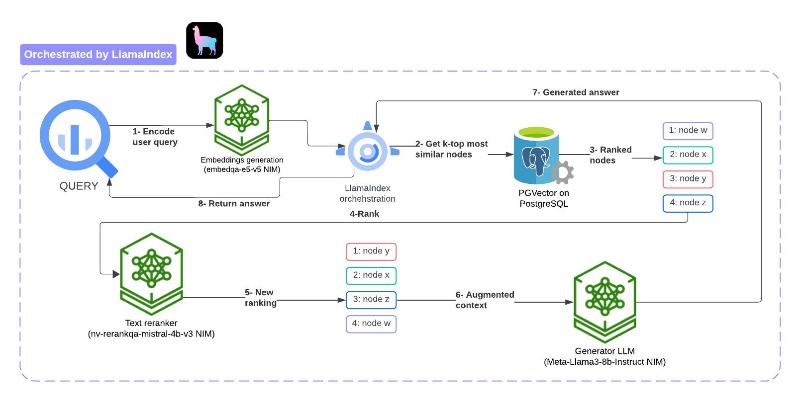

# Improved RAG Architectures

As mentioned in the Improved Stater Pack's root README.md file, we explore three RAG pipeline
architectures powered by __[LlamaIndex v0.11.x](https://docs.llamaindex.ai/en/stable/)__ and the following NVIDIA NIMs:

- NVIDIA NIM for Text Embedding serving the `NV-EmbedQA-E5-v5` model.
- NVIDIA NIM for Text Reranking serving the `nv-rerankqa-mistral-4b-v3` model.
- NVIDIA NIM for LLMs serving the `meta/llama3-8b-instruct` model.

## Presenting Three Approaches to RAG Pipelinee Architectures

- **Standard RAG Pipeline + re-ranker:** The initial approach implements a standard RAG pipeline architecture
  that incorporates a final reranking step powered by a reranker language model. Unlike the embedding model,
  a reranker uses questions and documents as input and directly outputs similarity instead of embedding. You
  can get a relevance score by inputting the query and passage to the reranker which will feed the responses generator
LLM with the most relevant passages first. The RAG pipelines implemented
  in this notebook use the __[Nvidia nv-rerankqa-mistral-4b-v3`](https://build.nvidia.com/nvidia/rerank-qa-mistral-4b)__
  model.

  The following picture illustrates how the re-ranking process works.

  

- **The Sentence Window Retrieval (SWR)** architecture improves the accuracy and relevance of
  information extraction in RAG pipelines by focusing on a specific window of sentences surrounding a target sentence.
  This focused approach increases precision by filtering out irrelevant information and enhances efficiency by
  reducing the volume of text processed during retrieval. Developers can adjust the size of this window to better
  tailor their searches according to the needs of their specific use cases. However, the method has potential
  drawbacks; concentrating on a narrow window risks missing critical information in adjacent text, making the
  selection of an appropriate context window size crucial to optimize both the precision and completeness of the
  retrieval process. The Jupyter Notebook in this directory uses LlamaIndex's implementation of SWR via the
  Sentence Window Node Parsing module that splits a document into nodes, each being a sentence. Each node contains a
  window from the surrounding sentences in the nodes’ metadata. This list of nodes gets re-ranked before being passed
  to the LLM to generate the query response based on the data from the nodes.

- **Auto Merging Retrieval** is a RAG architecture designed to address the issue of context
  fragmentation in language models, mainly when traditional retrieval processes produce disjointed text snippets. This
  method introduces a hierarchical structure where smaller text chunks are linked to larger parent chunks. During
  retrieval, if a certain threshold of smaller chunks from the same parent chunk is met, these are automatically
  merged. This hierarchical and merging approach ensures that the system gathers larger, coherent parent chunks instead
  of retrieving fragmented snippets. The notebook in this directory uses LlamaIndex’s  AutoMergingRetriever to implement
  this RAG variant. Notice that LlamaIndex uses PostgreSQL directly (PGVector is not used) as the document + embeddings
store.

To gauge the effectiveness of each approach, we make each RAG pipeline generate answers for the query/answer pairs from the evaluation set generated by the Jupyter
Notebook from `04-RAG_Dataset_Generation`. The evaluation set consists of 40 samples by default.

Each RAG pipeline generates a response for every query, and the collected responses get saved
in the `./reponses/current` directory of each RAG implementation, for future evaluations.
Please refer to the README file from the `06-RAG_System_Evaluation`
directory to learn more about the RAG pipeline's evaluation process.

Things to consider before running the three Jupyter Notebooks in this folder:

- Ensure the `07-Starter_Pack_config/improved_rag_config.yaml` configuration file properly points to the right
  hostnames/IP addresses in section `Language models configuration`, specifically the `api_base` values for the
  `LLM NIM`,  `Text re-ranking NIM` and `Text embedding NIM` which use the `lab-server-vm` hostname by default.
- In the same configuration file, the `Data files' names and paths` section defines the location of the
  knowledge base files and the directory paths for each RAG implementation. This is mainly for your information as
you are not expected to modify these directory and file paths.

__
